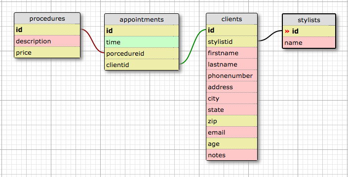

# Spark Salon
Version 0.0.0: September 23, 2016

by [Karen Freeman-Smith](https://github.com/karenfreemansmith)

## Description
Final Project for Week 3, Java at Epicodus. A program to manage a hair salon with stylists and clients using Java, PostgreSQL, and Spark with JUnit tests and RESTful routing.

### Specifications
#### User Stories:
* As a salon employee, I need to be able to see a list of all our stylists.
* As an employee, I need to be able to select a stylist, see their details, and see a list of all clients that belong to that stylist.
* As an employee, I need to add new stylists to our system when they are hired.
* As an employee, I need to be able to add new clients to a specific stylist.
* As an employee, I need to be able to update a stylist's details.
* As an employee, I need to be able to update a client's details.
* As an employee, I need to be able to delete a stylist if they're no longer employed here.
* As an employee, I need to be able to delete a client if they no longer visit our salon.

#### Database Diagram:

#### Technical Specifications:

| Behavior | Input | Output |
|-------------------------|-----------------------------------------|--------------------------|
| Store stylist name | Cheryl | Cheryl |
| Assign stylist id | Cheryl | # > 0 |
| List all stylists | n/a | List size >1 |
| Update stylist info | Cheryl > Steve | Steve |
| Delete stylists | id# | null |
| Store client info: |  |  |
| List clients by stylist | stylist# | List size > 0 |
| assign client id | Karen | # > 0 |
| firstname | Karen | Karen |
| lastname | Freeman | Freeman |
| address | 1710 Henderson Ave | 1710 Henderson Ave |
| city | Eugene | Eugene |
| state | OR | OR |
| zip | 97403 | 97403 |
| phonenumber | 503-331-2346 | 503-331-2346 |
| email | karen@sample.com | karen@sample.com |
| age | 50 | 50 |
| notes | allergies | allergies |
| Update client info | (age) 50 > 52 | 52 |
| Delete clients | id# | null |
| Store appointments: |  |  |
| assign appointment id | 2016-10-19 10:00 | # > 0 |
| date and time | 2016-10-19 10:00 | October 19, 2016 10am |
| procedure | hair cut & color | hair cut & color |
| price | 25 | $25.00 |
| Update appointment info | (procedure) hair cut & color > hair cut | hair cut, (price) $10.00 |
| Delete appointments | id# | null |
| Store procedures: |  |  |
| assign procedure id | hair cut & color | # > 0 |
| description | hair cut & color | hair cut & color |
| price | 25 | $25.00 |
| Update procedures | (price) 25 > 35 | $35.00 |
| Delete procedures | id# | null |

## Setup/Installation
* Clone directory
* Setup database in PSQL:
  * CREATE DATABASE hair_salon;
  * \c hair_salon
  * CREATE TABLE clients (id serial PRIMARY KEY, stylistid int, firstname varchar, lastname varchar, phonenumber varchar, address varchar, city varchar, state varchar, zip int, email varchar, age int, notes varchar);
  * CREATE TABLE stylists (id serial PRIMARY KEY, name varchar);
  * CREATE TABLE appointments (id serial PRIMARY KEY, time varchar, procedureid int, clientid int);
  * CREATE TABLE procedures (id serial PRIMARY KEY, description varchar, price float);
  * CREATE DATABASE hair_salon_test WITH TEMPLATE hair_salon;
* OR ... restore database from backup by running
  * CREATE DATABASE hair_salon;
  * psql hair_salon < db_backup.sql
  * CREATE DATABASE hair_salon_test;
  * psql hair_salon_test < db_backup.sql
* Type 'gradle run' inside the directory
* Navigate to 'http://localhost:4567'

## Support & Contact
For questions, concerns, or suggestions please email karenfreemansmith@gmail.com

## Known Issues
* N/A

## Technologies Used
Java, JUnit, Spark, PostgreSQL, Gradle

## Legal
*Licensed under the GNU General Public License v3.0*

Copyright (c) 2016 Copyright _Karen Freeman-Smith_ All Rights Reserved.
